# 🛍️ FabricHub - Modern E-Commerce Platform

**FabricHub** is my full-stack e-commerce clothing store built with **Spring Boot** and **React**. I've created a seamless shopping experience with modern UI, secure authentication, and powerful backend APIs!

---

### **🛍️ Advanced Product Catalog with Smart Filtering**
Developed a sophisticated product browsing system with real-time filtering, pagination, and search capabilities.

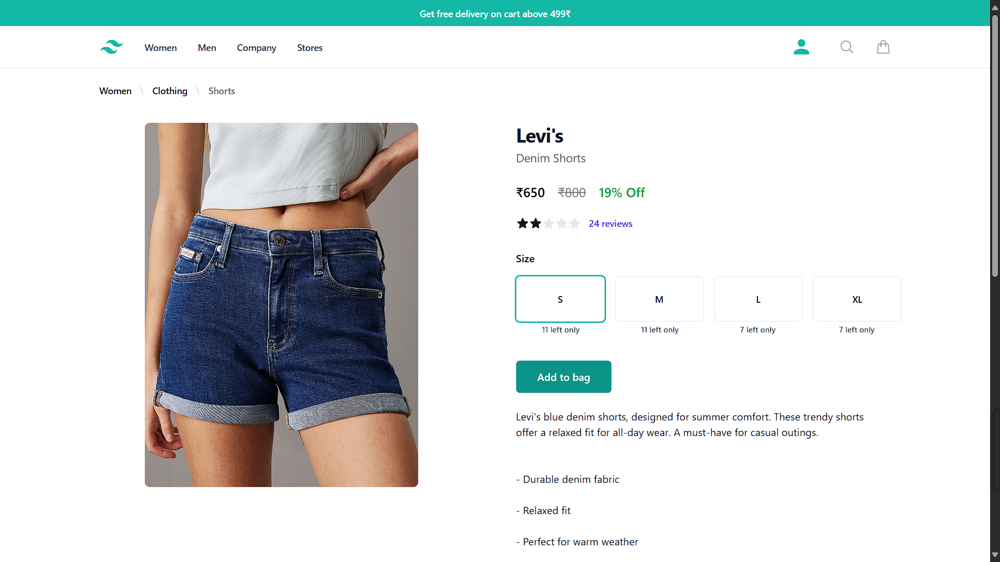

### **🔧 RESTful API Architecture - Enterprise Grade**
Designed a robust backend architecture with comprehensive API endpoints for seamless frontend-backend communication.

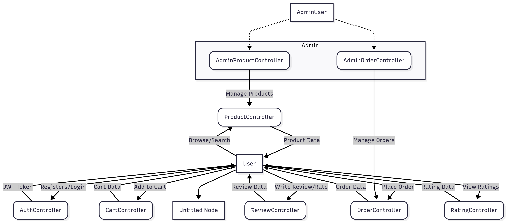

---

## 🌟 **Features Implemented**

✨ **JWT Authentication** - Built secure token-based user management with cookie storage  
🛒 **Smart Shopping Cart** - Created real-time cart updates with quantity management  
📦 **Complete Order Lifecycle** - Developed full order tracking from cart to delivery  
⭐ **Review & Rating System** - Implemented customer feedback with product ratings  
🔍 **Advanced Product Search** - Built multi-parameter filtering (category, price, color, brand)  
📱 **Responsive Design** - Crafted modern UI with TailwindCSS and Material-UI  
🔐 **Admin Dashboard** - Created comprehensive product and order management  
🏪 **Multi-level Categories** - Designed hierarchical product organization  
💳 **Payment Integration** - Prepared for Razorpay integration  
🚚 **Order Status Tracking** - Built real-time order status updates  

---

## 🏠 **Homepage Showcase**

Created this stunning homepage that showcases the latest fashion trends with an intuitive navigation experience.

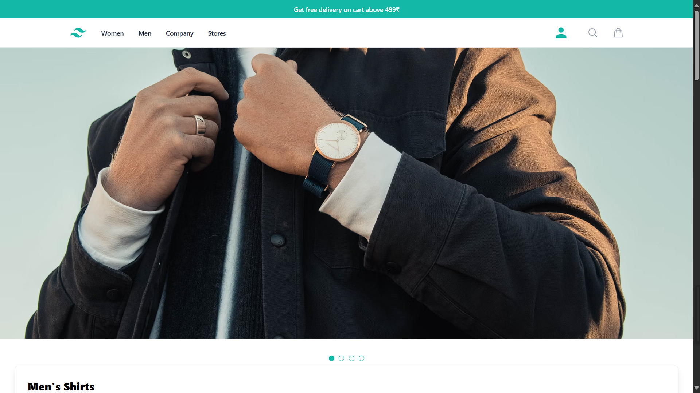

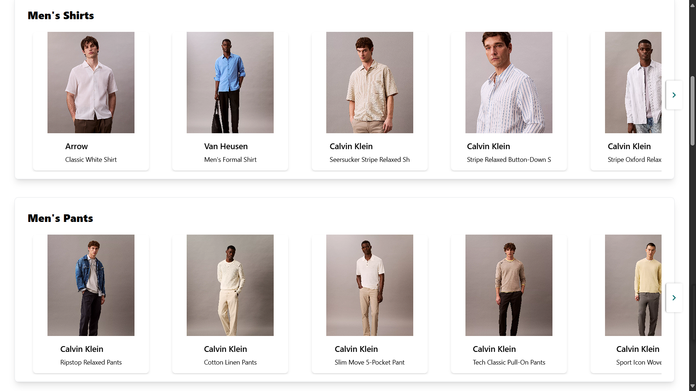

---

## 🔐 **Authentication System - Security First**

Built a robust JWT-based authentication system with secure cookie management and user session handling.

**What I implemented:**
- User registration with validation
- Secure login with JWT tokens
- Cookie-based session management
- 
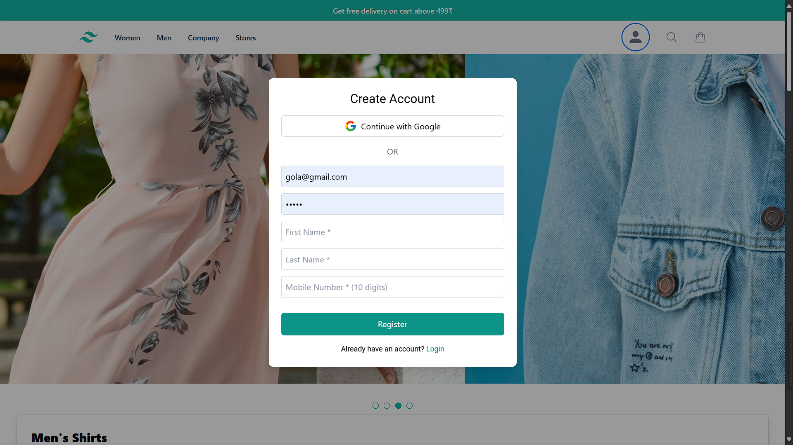

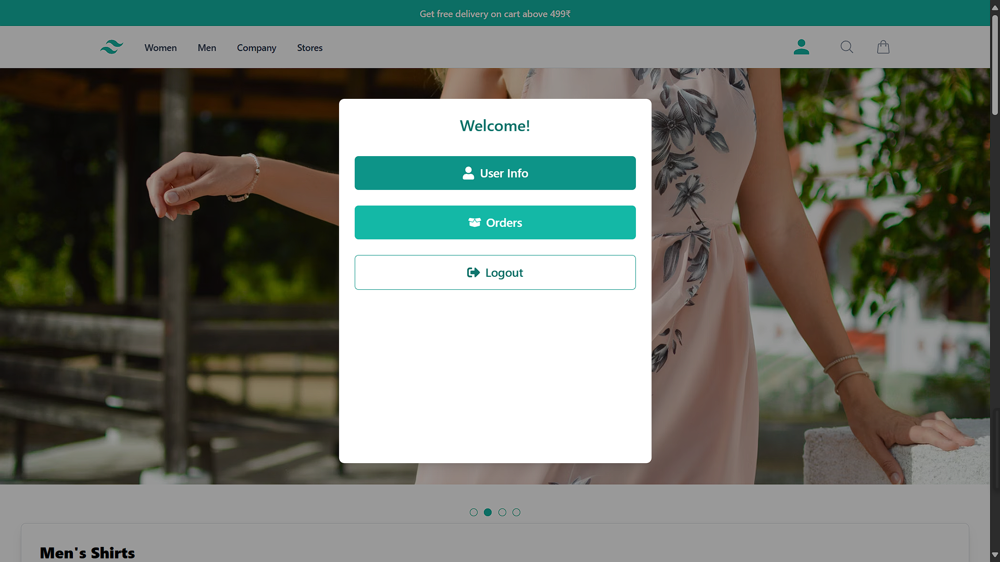

---

## 🛒 **Shopping Cart - Smart & Intuitive**

Developed intelligent cart management with real-time updates, quantity control, and price calculations.

**Features I built:**
- Add/remove items with size selection
- Quantity management
- Real-time price calculation
- Cart persistence across sessions

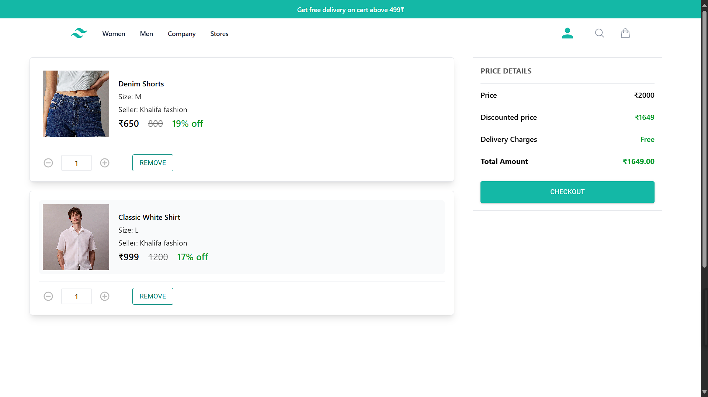

---

## ⭐ **Review System - Customer Voice**

Created a comprehensive review system allowing customers to share detailed feedback and ratings.

**What I included:**
- Product rating system
- Detailed text reviews
- User-specific review management
- Average rating calculations

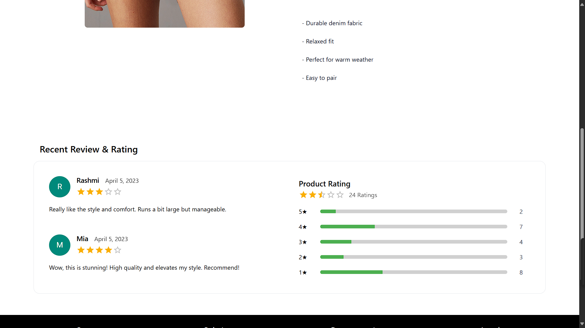

---

## 👤 **User Dashboard - Personal Space**

Built complete user profile management with order history, address management, and personal information.

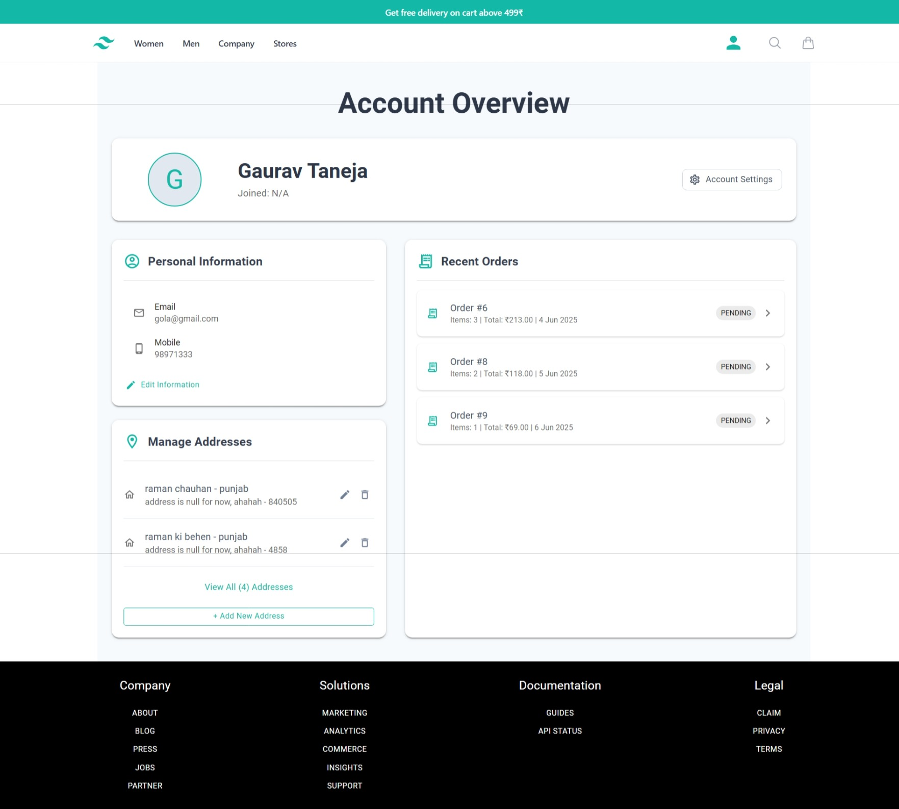

---

## 🎯 **Admin Panel - Management Made Easy**

Designed a powerful admin interface for managing products, categories, and inventory with bulk operations.

**Admin features I built:**
- Product CRUD operations
- Category management
- Bulk product creation
- Order status management
- Inventory tracking

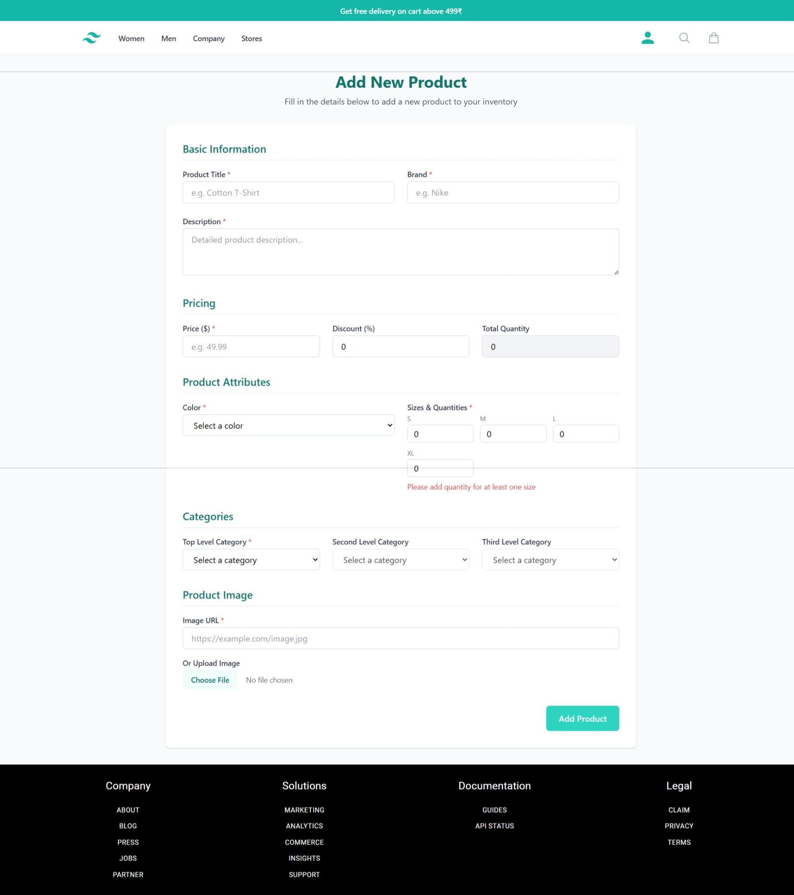

---

## 🚚 **Order Management - Complete Control**

Developed a full order management system from placement to delivery with comprehensive status tracking.

**Order features I implemented:**
- Multi-step order process
- Address management
- Payment integration ready
- Order status updates (PLACED → CONFIRMED → SHIPPED → DELIVERED)
- Order cancellation

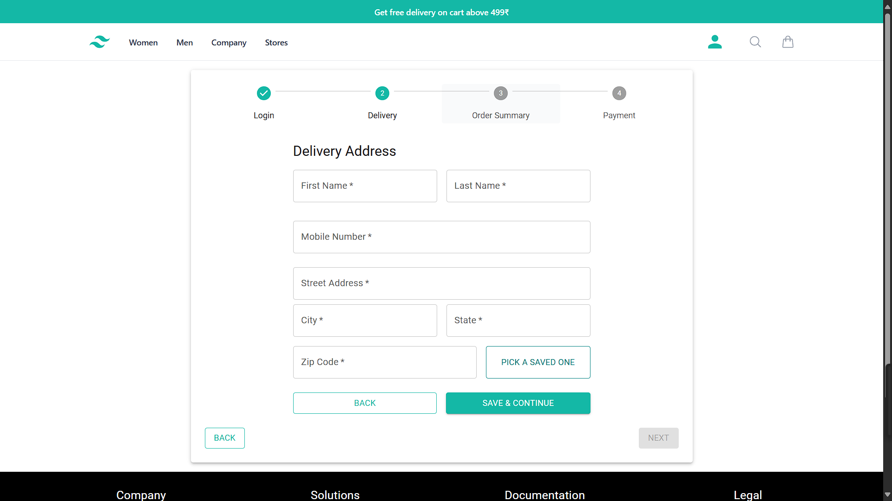

---

## 🛠️ **Tech Stack I Used**

### **Backend (Spring Boot 3.4.4)**
- **Java 21** - Latest LTS with modern features
- **Spring Security** - JWT authentication & CORS configuration
- **Spring Data JPA** - Advanced query methods and pagination
- **MySQL** - Production-ready database with optimized queries
- **Hibernate** - ORM with automatic DDL updates
- **Maven** - Dependency management and build automation
- **Swagger/OpenAPI** - Comprehensive API documentation
- **Lombok** - Reduced boilerplate code
- **Docker** - Containerization ready

### **Frontend (React 19)**
- **Vite** - Lightning-fast build tool and HMR
- **TailwindCSS** - Utility-first styling framework
- **Material-UI** - Professional React components
- **Axios** - Promise-based HTTP client
- **React Router** - Client-side routing with protected routes
- **React Hook Form** - Efficient form handling

---

## 🚀 **How to Run My Project**

### **Prerequisites**
- Java 21+
- Node.js 18+
- MySQL 8.0+
- Maven 3.6+

### **Backend Setup**
```bash
# Clone my repository
git clone https://github.com/yourusername/FabricHub.git
cd FabricHub/fabricHub

# Configure database
cp .env.example .env
# Update database credentials in .env

# Run the application
./mvnw spring-boot:run
```

### **Frontend Setup**
```bash
# Navigate to frontend directory
cd ../frontend

# Install dependencies
npm install

# Start development server
npm run dev
```

### **Database Configuration**
```properties
# Update fabricHub/.env
DB_URL=jdbc:mysql://localhost:3306/fabrichub
DB_USER=your_username
DB_PASS=your_password
FRONTEND_URL=http://localhost:5173/
```

---

## 📡 **API Endpoints I Created**

### **Authentication**
- `POST /api/auth/register` - User registration
- `POST /api/auth/login` - User login with JWT
- `POST /api/auth/logout` - Secure logout

### **Products (Public)**
- `GET /api/public/products` - Advanced product filtering
- `GET /api/public/products/{id}` - Product details
- `GET /api/public/products/search` - Multi-field search

### **Cart Management**
- `GET /api/cart` - Get user cart
- `POST /api/cart/add` - Add item to cart
- `PUT /api/cart/update` - Update cart item
- `DELETE /api/cart/item/{id}` - Remove cart item

### **Order Processing**
- `POST /api/orders/create/new/{addressId}` - Create order
- `GET /api/orders` - Get user orders
- `GET /api/orders/{id}` - Order details

### **Admin Operations**
- `POST /api/admin/products/create` - Create product
- `POST /api/admin/products/create/max` - Bulk product creation
- `PUT /api/admin/products/{id}` - Update product
- `DELETE /api/admin/products/{id}` - Delete product

### **Reviews & Ratings**
- `POST /api/reviews` - Create review
- `GET /api/reviews/product/{id}` - Get product reviews
- `POST /api/ratings` - Rate product

---

## 📊 **Project Architecture**

```
FabricHub/
├── fabricHub/                 # Spring Boot Backend
│   ├── src/main/java/
│   │   └── com/geto/fabricHub/
│   │       ├── controller/    # REST Controllers (11 classes)
│   │       ├── service/       # Business Logic (27 classes)
│   │       ├── model/         # JPA Entities (16 classes)
│   │       ├── repo/          # Data Repositories (15 interfaces)
│   │       ├── dto/           # Data Transfer Objects (11 classes)
│   │       ├── config/        # Configuration Classes (5 classes)
│   │       ├── exception/     # Exception Handling (4 classes)
│   │       └── RunnerService/ # Data Seeders (3 classes)
│   ├── src/main/resources/
│   │   └── application.properties
│   ├── Dockerfile             # Container configuration
│   ├── Procfile              # Deployment configuration
│   └── pom.xml               # Maven dependencies
├── frontend/                  # React Frontend
│   ├── src/
│   │   ├── components/        # Reusable Components
│   │   ├── pages/            # Page Components
│   │   ├── context/          # React Context (Auth)
│   │   └── customer/         # Customer Features
│   ├── package.json          # Node dependencies
│   └── vite.config.js        # Vite configuration
└── screenshots/              # Project Screenshots
```

---

## 🌐 **Try It Out**

🔗 **Frontend**: [http://localhost:5173](http://localhost:5173)  
📚 **API Docs**: [http://localhost:8080/swagger-ui.html](http://localhost:8080/swagger-ui.html)  
🔧 **Backend**: [http://localhost:8080](http://localhost:8080)

---

## 🚀 **Deployment Ready**

I've made this project deployment-ready with:
- **Docker**: Containerized with Dockerfile
- **Heroku**: Procfile included for easy deployment
- **Production**: Environment-based configuration

---

## 🤝 **Want to Contribute?**

Feel free to explore my code, learn from it, or use it as inspiration for your own projects!

If you have suggestions:
1. Fork the repository
2. Create your feature branch (`git checkout -b feature/AmazingFeature`)
3. Commit your changes (`git commit -m 'Add some AmazingFeature'`)
4. Push to the branch (`git push origin feature/AmazingFeature`)
5. Open a Pull Request

---

## 📝 **License**

This project is licensed under the MIT License - see the [LICENSE](LICENSE) file for details.

---

## 👨‍💻 **About Me**

I'm a passionate developer who loves creating amazing user experiences and robust backend systems! This project showcases my full-stack development skills with modern technologies.

**Skills I demonstrated:**
- Full-stack development (Spring Boot + React(ai-driven))
- RESTful API design and implementation
- Database design and JPA relationships
- JWT authentication and security
- Modern frontend development with React 19
- Responsive UI design with TailwindCSS
- Docker containerization
- Production deployment readiness

---

## 🙏 **Thanks To**

- Spring Boot community for the amazing framework
- React team for the incredible frontend library
- Ai tools helping me create the frontend 
- All the open-source contributors who made this possible

---

**⭐ Star this repository if you found it helpful!**
