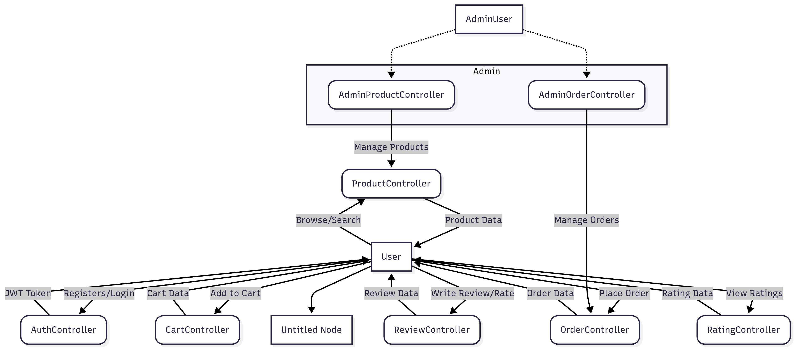
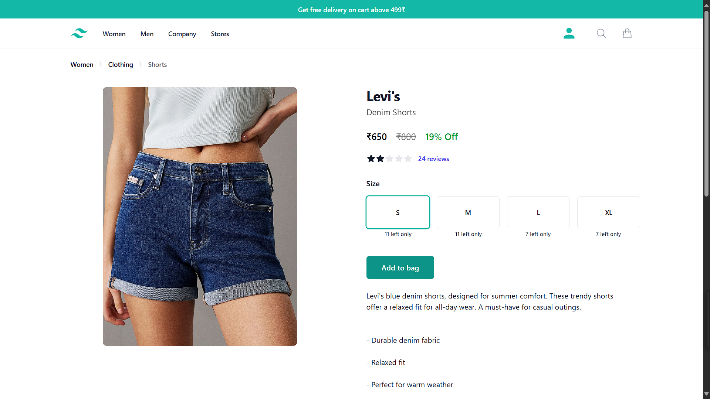
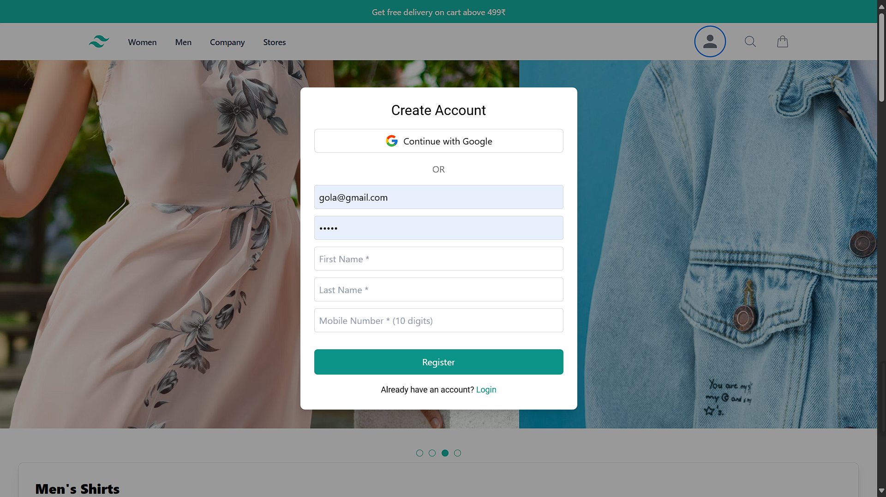
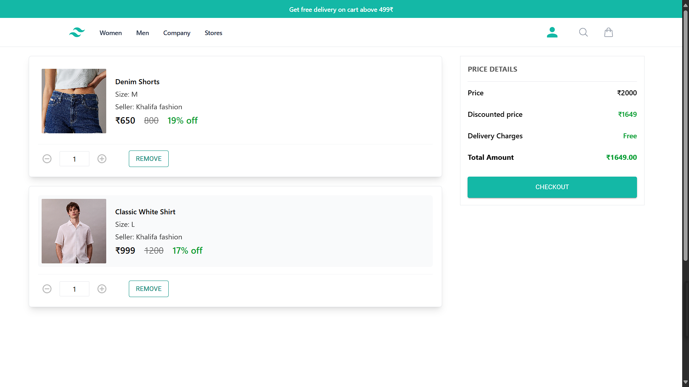
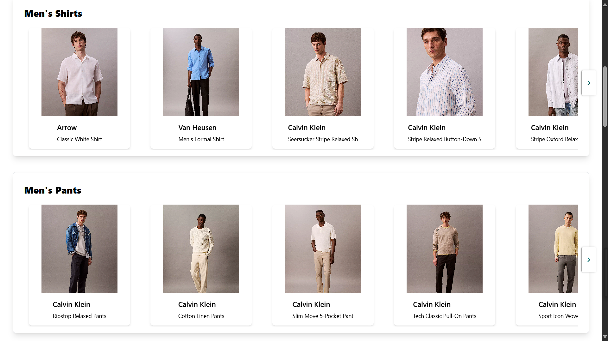
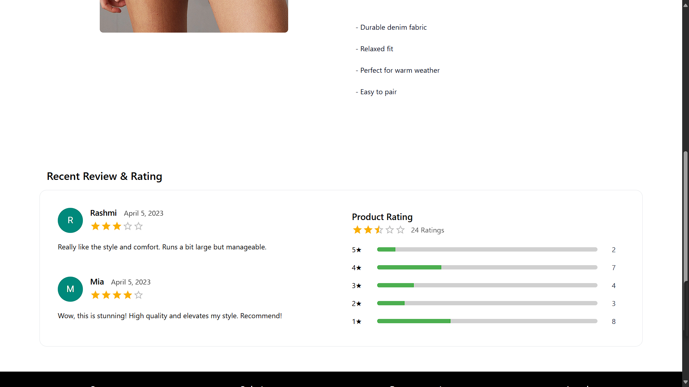
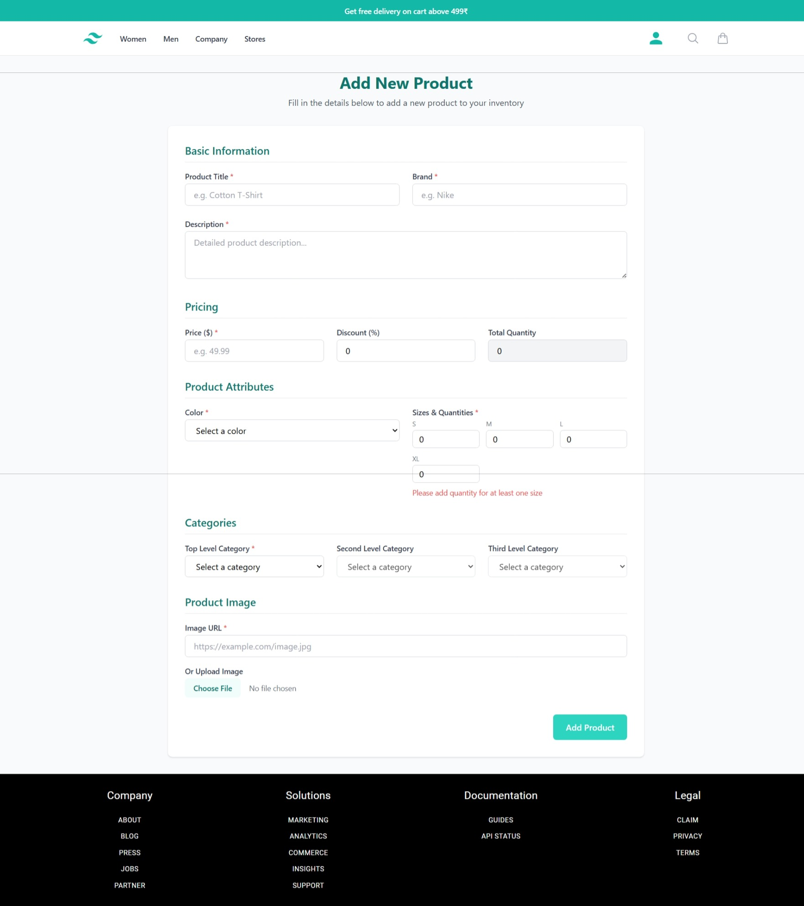

## Overview

**fabricHub** is a modern "Full-Stack" clothing web app built with Spring Boot and React. It provides robust APIs for user authentication, product management, order processing, cart operations, reviews, and ratings. Designed for scalability and security, fabricHub is ideal for powering online retail platforms.

---

### 🧑‍💻 API flow


---

## Table of Contents
- [Overview](#overview)
- [Features](#features)
- [Tech Stack](#tech-stack)
- [Getting Started](#getting-started)
- [Usage](#usage)
- [API Documentation](#api-documentation)
- [Deployment](#deployment)
- [Screenshots](#screenshots)
- [License](#license)

---

## Features
- User registration, login, and JWT-based authentication
- Product listing, filtering, and search
- Cart and order management
- Product reviews and ratings
- Admin endpoints for product and order management
- RESTful API design
- Swagger/OpenAPI documentation

---

## Tech Stack
- **Java 21/22**
- **Spring Boot 3**
- **Spring Security**
- **Spring Data JPA**
- **MySQL**
- **JWT (JSON Web Tokens)**
- **Lombok**
- **Swagger / OpenAPI**

---

## Getting Started

### Prerequisites
- Java 21 or higher
- Maven
- MySQL database

### Setup
1. **Clone the repository:**
   ```bash
   git clone https://github.com/yourusername/fabricHub.git
   cd fabricHub
   ```
2. **Configure the database:**
   - Update `src/main/resources/application.properties` with your MySQL credentials and database URL.
3. **Build the project:**
   ```bash
   mvn clean install
   ```
4. **Run the application:**
   ```bash
   mvn spring-boot:run
   ```
   or
   ```bash
   java -jar target/fabricHub-0.0.1-SNAPSHOT.jar
   ```

---

## Usage

- The server runs by default on [http://localhost:8081](http://localhost:8081)
- API endpoints are available under `/api/*` (see API Documentation below)
- Use tools like Postman or Swagger UI to interact with the API

---

## API Documentation

- Swagger UI is enabled for easy API exploration and testing.
- Once the server is running, access the docs at:
  - [http://localhost:8081/swagger-ui.html](http://localhost:8081/swagger-ui.html)
  - or [http://localhost:8081/swagger-ui/index.html](http://localhost:8081/swagger-ui/index.html)

---

## Deployment

- The project includes a `Procfile` for deployment on platforms like Heroku or Railway.
- Default start command:
  ```bash
  java -jar target/fabricHub-0.0.1-SNAPSHOT.jar
  ```

---

## Screenshots

### 🧑‍💻 Product page


### 🧑‍💻 login page


### 🧑‍💻 Cart page


### 🧑‍💻 Homepage


### 🧑‍💻 Rating Review page


### 🧑‍💻 Add Products


---

## License

This project is licensed under the MIT License. See the [LICENSE](LICENSE) file for details.

---

## Author

- Get0suguru
- linkedin - http://www.linkedin.com/in/get%C5%8D-suguru-430379275

=
